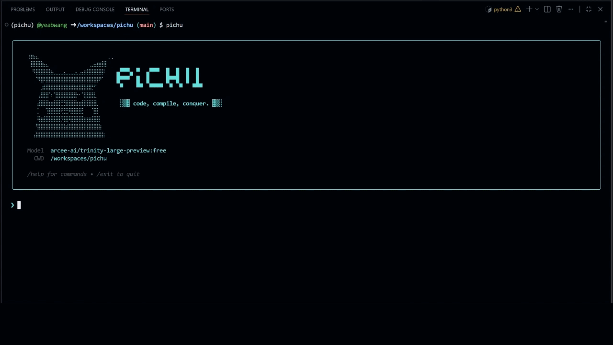

<p align="center">
  <br/>
  <strong>⚡ pichu — code, compile, conquer.</strong><br/>
  Coding agent that lives in your terminal.
</p>

---

<p align="center">
  
</p>

## Features

- **Composable tooling stack** — file editing/search, shell, web research, task tools, and memory tools
- **Context management** — token-aware context windows with compaction, tool-output pruning, and usage tracking
- **MCP integration** — connect and manage external MCP servers, with namespaced MCP tools available alongside built-ins
- **Sub-agent orchestration** — delegate work to specialized sub-agents with isolated context, scoped tool access, and resume/background support
- **28 slash commands** — operational control for config, diagnostics, sessions, permissions, hooks, tasks, MCP, GitHub setup, and more
- **Web tooling with guardrails** — structured search/fetch, citation-style outputs, cache modes, rate limits, provenance checks, and PDF extraction
- **Session system** — JSONL transcript persistence, metadata indexing, resume/continue, checkpoints, rewind, and forked sessions
- **Memory system** — global + project memory stores, AGENTS hierarchy loading, and searchable categorized memories
- **Task orchestration** — persistent task lists with status transitions, dependency graphs, ownership, and cross-session coordination
- **Hooks automation** — lifecycle hooks (`PreToolUse`, `PostToolUse`, `Stop`, `PreCompact`, `SubagentStop`, etc.) with matcher-based routing
- **Safety by default** — approval policies, rule-based permission engine, dangerous-command detection, and filesystem sandbox enforcement
- **Reliability controls** — LLM retry/backoff, loop detection, context compaction, tool-output pruning, and runtime/audit logging

## Quick Start

### 1) Prerequisites

- Python 3.11+
- [uv](https://docs.astral.sh/uv/) (recommended)
- An LLM API key (for example, [OpenRouter](https://openrouter.ai/))

### 2) Install

```bash
# uv tool install (recommended for end users)
uv tool install pichu

# pip
pip install pichu

# Linux/macOS one-line installer
curl -fsSL https://raw.githubusercontent.com/yeabwang/pichu/main/install.sh | bash
```

### 3) Configure model credentials

Interactive (recommended):

```bash
pichu
/login
```

Environment variable:

```bash
# Linux / macOS
export LLM_API_KEY="your-key-here"

# Windows PowerShell
$env:LLM_API_KEY = "your-key-here"
```

Base URL and model are configured via `/login` (stored in `~/.pichu/config.toml`).

### 4) Initialize project files

Inside a `pichu` session in your project directory, run:

```bash
/init
```

This generates `AGENTS.md`, `AGENTS.local.md`, and `.pichu/config.toml` for the current project.

### 5) Run and validate

```bash
# Interactive mode
pichu

# Single prompt
pichu "explain this repo"

# Run tests
uv run pytest -q

```

### CLI Options

```
pichu [PROMPT]              Run interactively, or execute a single prompt
  -c, --cwd PATH            Set working directory for the agent
  -C, --continue             Resume the most recent session in this directory
  -r, --resume ID_OR_TITLE   Resume a specific session by ID or title
```

## Commands

pichu includes 28 slash commands for runtime control. Type `/help` inside a session for the full list.

| Command          | Description                                      |
| ---------------- | ------------------------------------------------ |
| `/agents`      | List loaded sub-agents                           |
| `/clear`       | Clear conversation history                       |
| `/compact`     | Compact context with optional focus instructions |
| `/config`      | View or open settings configuration              |
| `/context`     | Visualize context token usage                    |
| `/copy`        | Copy last response to clipboard                  |
| `/cost`        | Token usage and cost statistics                  |
| `/debug`       | Troubleshoot current session                     |
| `/doctor`      | Health check installation                        |
| `/exit`        | Exit the session                                 |
| `/export`      | Export conversation to file                      |
| `/fork`        | Fork this session into a new branch              |
| `/github`      | Setup/status for GitHub MCP tasks                |
| `/help`        | Display help information and available commands  |
| `/hooks`       | Display registered lifecycle hooks               |
| `/init`        | Initialize project with AGENTS.md                |
| `/login`       | Configure API key, provider, and model           |
| `/mcp`         | Manage MCP server connections                    |
| `/memory`      | Edit memory files (AGENTS.md)                    |
| `/model`       | Switch or view the AI model                      |
| `/permissions` | Show approval policy and permission rules        |
| `/rename`      | Rename the current session                       |
| `/rewind`      | Rewind to a previous checkpoint                  |
| `/sessions`    | List and manage saved sessions                   |
| `/stats`       | Usage visualizations (tokens, turns, duration)   |
| `/status`      | Version, model, and connectivity info            |
| `/tasks`       | List and manage tasks                            |
| `/theme`       | Change color theme                               |

## Built-in Tools

The agent has access to 16 built-in tools:

| Tool            | Description                               |
| --------------- | ----------------------------------------- |
| `read_file`   | Read file contents                        |
| `write_file`  | Create or overwrite files                 |
| `edit_file`   | Apply targeted edits to existing files    |
| `batch_apply` | Apply multiple file operations atomically |
| `shell`       | Execute shell commands                    |
| `list_dir`    | List directory contents                   |
| `grep`        | Search file contents with regex           |
| `glob`        | Find files by name pattern                |
| `web_search`  | Search the web                            |
| `web_fetch`   | Fetch and extract web page content        |
| `task_create` | Create a task in the task list            |
| `task_update` | Update task status or metadata            |
| `task_get`    | Get details of a specific task            |
| `task_list`   | List all tasks                            |
| `memory`      | Save, search, or manage project memory    |
| `subagent_*`  | Delegate work to a specialized sub-agent  |

## Configuration

Configuration is loaded in this order (later sources override earlier ones):

1. **Code defaults** — sensible baseline values
2. **System config** — `~/.pichu/config.toml`
3. **Project config** — `.pichu/config.toml` (searched upward from cwd)
4. **System .env** — `~/.pichu/.env` (used for persisted keys from `/login`)
5. **Project .env** — `.env` in the current working directory
6. **Environment overrides** — `LLM_API_KEY` and `PICHU_DEBUG`

Behavior instructions for the agent are loaded from `AGENT.md` in the nearest discovered `.pichu` directory.

## Troubleshooting

When something goes wrong, use this recovery flow:

1. Run `/doctor` for a full installation + config health check.
2. Run `/status` to verify model/provider/session state.
3. Run `/debug` for runtime diagnostics in the current session.
4. Check logs in `logs/app/` and `logs/security/audit.log` for concrete errors.

Common cases:

- **API failures (401/403/5xx):** re-run `/login`, then confirm `LLM_API_KEY` and `llm.base_url` / `llm.model` in `~/.pichu/config.toml`.
- **MCP connection issues:** run `/mcp` to inspect configured servers and connection state.
- **Sandbox violations:** review `[safety.sandbox]` in `.pichu/config.toml` and allowed path settings.

### Environment Variables

| Variable              | Required | Description                                        |
| --------------------- | -------- | -------------------------------------------------- |
| `LLM_API_KEY`       | Yes      | API key for your LLM provider                      |
| `SERPER_API_KEY`    | No       | API key for web search (Serper)                    |
| `PICHU_DEBUG`       | No       | Enable debug logging (`true`/`false`)          |
| `PICHU_PROJECT_DIR` | No       | Project config directory name (default:`.pichu`) |
| `PICHU_CONFIG_FILE` | No       | Config file name (default:`config.toml`)         |

## Development

### Install

Option A (recommended): use uv project sync + Makefile workflow

```bash
git clone https://github.com/yeabwang/pichu.git
cd pichu

uv venv

uv sync --extra dev
uv run pre-commit install
```

Option B: requirements-based install

```bash
git clone https://github.com/yeabwang/pichu.git
cd pichu

uv venv
uv pip install -r requirements-dev.txt && uv pip install -e .
```

### Requirements Files

| File                     | Contents                                  |
| ------------------------ | ----------------------------------------- |
| `requirements.txt`     | Runtime dependencies (core + web tooling) |
| `requirements-dev.txt` | Core + testing, linting, and build tools  |

Use the Makefile for common development workflows:

```bash
# Install dev dependencies + pre-commit hooks
make dev

# Common commands
make format      # auto-format with ruff
make lint        # lint with ruff
make typecheck   # type-check with mypy
make test        # run tests
make test-cov    # tests + coverage report
make build       # build package
make clean       # remove caches & artifacts
```

### Run Tests

```bash
uv run pytest -q
```

### Project Bootstrap

Inside a pichu session, run `/init` to generate a full `.pichu/config.toml` baseline and project guidance files. If these files are missing, startup now prompts you to run `/init`.

### Build

```bash
make build                    # produces sdist + wheel in dist/
# or: uv build
```

## Deployment

### Docker

```bash
docker build -t pichu:latest .
docker run --rm -it -e LLM_API_KEY=your-key -v "$(pwd)":/workspace pichu:latest
```

### CI

GitHub Actions runs tests and builds on every push/PR — see `.github/workflows/ci.yml`.

See [docs/deployment.md](docs/deployment.md) for full deployment details.

## Architecture

```
pichu/
├── main.py          CLI entrypoint — wires config → agent → TUI
├── src/
│   ├── agent/       Runtime orchestration loop, events, session lifecycle
│   ├── client/      LLM transport and stream parsing
│   ├── commands/    Slash command registry and 28 built-in handlers
│   ├── config/      Configuration schema, loader, and merge logic
│   ├── context/     Context window management and compaction
│   ├── hooks/       Lifecycle hook framework
│   ├── prompts/     System prompt construction
│   ├── safety/      Approval policies, sandbox, and command risk checks
│   ├── subagents/   Sub-agent loader/types/transcripts + bundled specs
│   ├── tools/       Built-in and MCP tool implementations
│   ├── ui/          Terminal rendering (Rich-based TUI)
│   └── utils/       Sessions, memory, tasks, web helpers, and more
├── tests/           Test suite (pytest)
└── docs/            Module-level developer documentation
```

## Documentation

Detailed developer guides for each module:

- [Agent Module](docs/agent-module.md) — runtime loop, events, session lifecycle
- [Client Module](docs/client-module.md) — LLM client, streaming, retry
- [Commands Module](docs/commands-module.md) — slash command system
- [Config Module](docs/config-module.md) — configuration schema and loading
- [Context Module](docs/context-module.md) — context management and compaction
- [Hooks Module](docs/hooks-module.md) — lifecycle hook engine
- [Logging Module](docs/logging-module.md) — runtime and audit logging
- [MCP Module](docs/mcp-module.md) — MCP server integration
- [Safety Module](docs/safety-module.md) — approval and sandbox policies
- [Sub-agents Module](docs/subagents-module.md) — sub-agent orchestration
- [Task Management](docs/task-management.md) — task system architecture
- [Tool Management](docs/tool-management.md) — tool registry and execution
- [Utils Module](docs/utils-module.md) — shared runtime utilities
- [Deployment](docs/deployment.md) — Docker, CI, and packaging

## License

Apache 2.0 — see [LICENSE](LICENSE).
